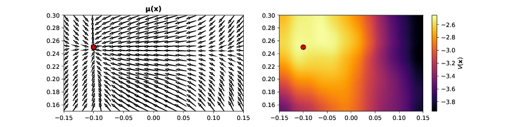

# Parallelized deep reinforcement learning for robotic manipulation
Master thesis in computer science and machine learning

- [Latest draft](https://www.dropbox.com/s/crbu38go3g5wsop/isac_arnekvist.pdf?dl=1)
- [Dropbox with literature](https://www.dropbox.com/sh/9id510as7zuvyls/AAAtI-pSpf-CgR1STtxP57uOa?dl=0)

Some results from first simulated experiments:

